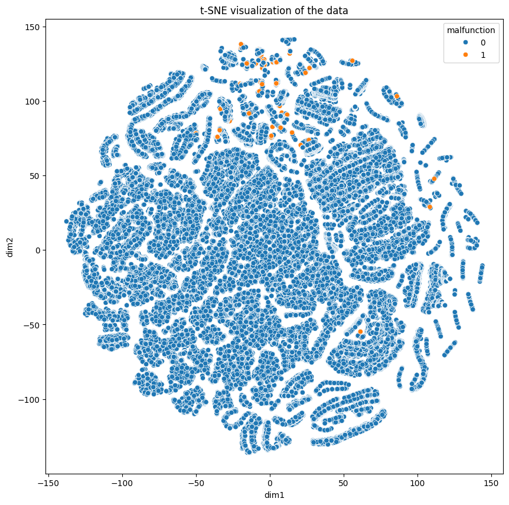

# husqvarna

## EDA
For the EDA, I have used ydata_profiling to get a quick overview of the dataset.
One of the first things to notice is the high imbalance in the dataset.
* Malfunction = No (124388 data points)
* Malfunction = Yes (106 data points)

Considering this extreme imbalance where malfunction data points is ~0.0008 times of the entire data samples, I will treat this problem as anomaly detection rather than a binary classification problem. Since we have 106 points for malfunction using binary classification will make it very difficult for the model to learn discriminative features for this class.

### Feature Engineering
### Skewed (Sparse)
For 5 of features, over 90% of the values are zero. 
* One way of dealing with these skewed values is used log transformation/square root transformation. (Square Root transformation produced better results)
* Another way should be using dimensionality reduction like PCA. (This is did not give good results) 

### Correlated features
Features 7 and 8 and highly correlated therefore dropping feature 8 while training the model

### Visualization
To view the dataset, I have used t-SNE. Before applying t-SNE, I have applied the following feature engineering steps (The same feature engineering steps have been used in while training the various models):
* Drop feature 8 as it highly correlated to feature 7.
* Skewed features (features 2,3,4,7,9) have been transformed using square root.
* Then features are then normalized to mean = 0 and std = 1.

In the figure below, most of the malfunctioning points (orange in colours) are towards one section. But they are still overlap with a lot of non-malfunctioning datapoints.



## Model/Algorithm selection
As for the model/algorithm selection, I have tried three approaches:

### Binary Classification using Neural Network
Considering we have only 106 data points for the malfunctions, it would be very difficult to train the neural network. To keep things simple, I have used a 3-layer N/W with 20 neurons in the hidden layer. ReLU has been chosen as the activation function with Adam optimization. Since, I do not have any information about what each feature means, it would be difficult to use any kind of SMOTE technique to deal with the imbalance. Thus, I have used loss reweighing with 1000 as the weight of the malfunction class. 80% data points are in the training set.

Label distribution is training set: 
* non-malfunctioning = 99507
* malfunctioning = 88

Label distribution is test set: 
* non-malfunctioning = 24881
* malfunctioning = 18

The results are as follows:

TP = 24602

TN = 4

FP = 279

FN = 14

| class | precision |   recall | f1-score  | support |
| ------|-----------|----------|--| --|
|0|       1.00    |  0.99|      0.99|     24881|
|           1    |   0.01    |  0.22    |  0.03     |   18|

As there are only 18 malfunctioning data points in the test set, it is very difficult to draw any strong conclusion on the model performance.

Command to run the test
```
python cli.py nn run  --data-file PATH/dataset.csv --num-epochs 100
```

### OneClassSVM
In the case, SVM is used to model the majority class (i.e. training set only contains the majority) while the test set contains both majority and minority class.
Label distribution is training set: 
* non-malfunctioning = 99507
* malfunctioning = 0

Label distribution is test set: 
* non-malfunctioning = 24881
* malfunctioning = 106

For the SVM, I have chosen to use the 'rbf' kernel function to enable non-linear decision boundary.

The results are as follows:

TP = 24809

TN = 24

FP = 72

FN = 82

| class | precision |   recall | f1-score  | support |
| ------|-----------|----------|--| --|
|0|       1.00    |  1.00|      1.00|     24881|
|           1    |   0.25    |  0.23    |  0.24     |   106|

Now, here we see much lower values for FP, FN.

```
python cli.py svm run --data-file PATH/dataset.csv 
```

Since these are just across one test set, I have also used f-fold classification to check consistency of the results across various folds. (Note: A few insights on the what the features entail perhaps may help in better feature engineering and therefore better anomaly detection.)

```
python cli.py svm run-kfold --data-file PATH/dataset.csv 
```

### Isolation Forest
Another method for anomaly detection. This also produced better results than the binary classification but not as good as the single class SVM (I haven't done an exhaustive hyperparameter tuning)
The results are as follows:

TP = 24258

TN = 47

FP = 623

FN = 59

| class | precision |   recall | f1-score  | support |
| ------|-----------|----------|--| --|
|0|       1.00    |  0.97|      0.99|     24881|
|           1    |   0.07    |  0.44    |  0.12     |   106|

Now, here we see higher value for TN, FN in comparison to one-class SVM but the FP has increased quite a bit.

```
python cli.py if run --data-file PATH/dataset.csv 
```


## Things I would like to explore
* Feature importance
* Combination (ensemble) of models 
* Better feature engineering